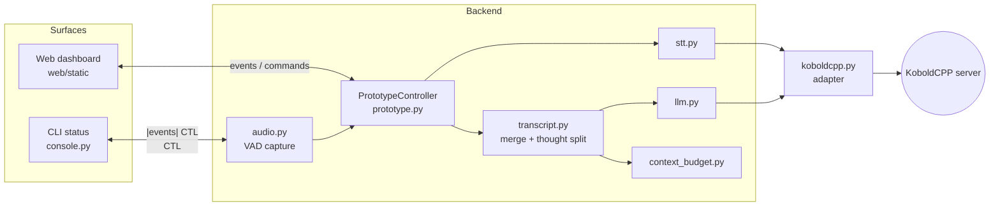
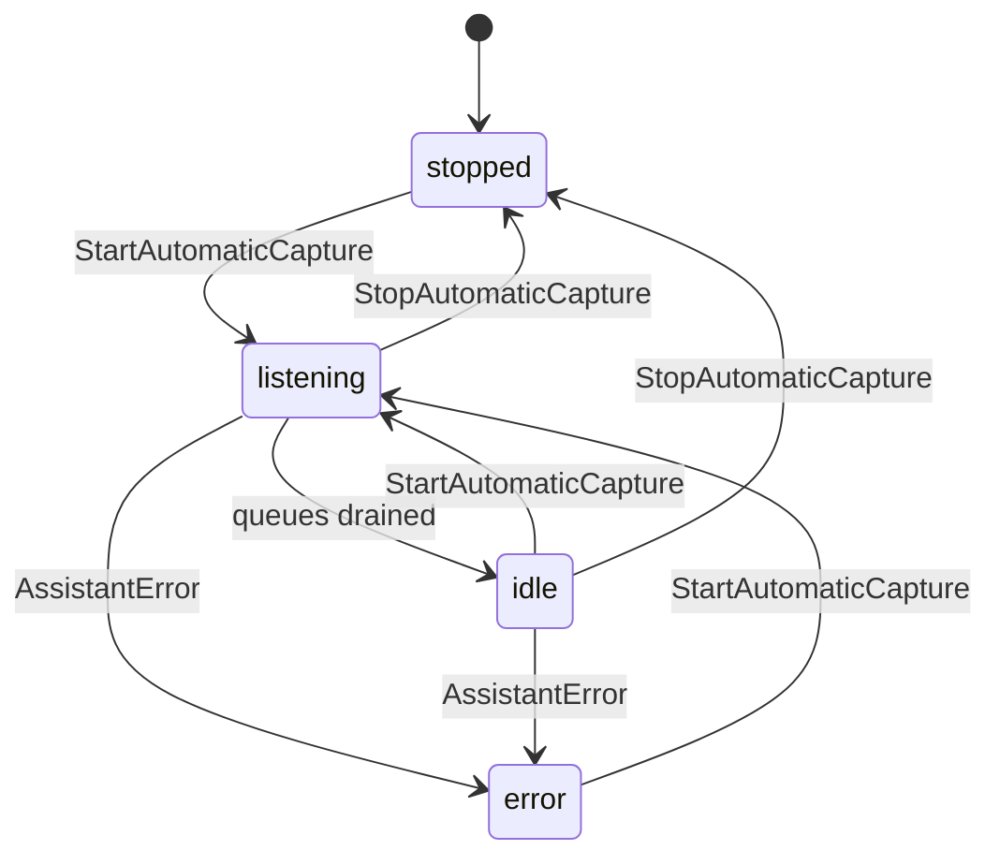

# pySecretary Design

This document is the project source of truth. When implementation changes behavior, module boundaries, or external interfaces, update this file in the same change.

Active planning lives in [`docs/planning/`](planning/). Keep milestone and TODO documents there, and move completed or outdated drafts into [`docs/planning/archive/`](planning/archive/).

All non-trivial work must follow the project operating protocol in [`docs/planning/protocol.md`](planning/protocol.md). Testing expectations live in [`docs/testing/strategy.md`](testing/strategy.md).

## Project Goal

pySecretary is a local voice secretary that listens to a microphone, transcribes speech through KoboldCPP Whisper, organizes the transcript through the local KoboldCPP LLM, and speaks selected responses through KoboldCPP TTS.

The assistant should feel continuous to the user, but the local KoboldCPP Whisper API is request/response. Continuous listening is implemented in the application by buffering microphone audio and sending completed speech turns or short chunks to the transcription endpoint.

## Current External Runtime

- KoboldCPP runs locally at `http://localhost:5001`.
- KoboldCPP exposes OpenAI-compatible endpoints for chat, transcription, and speech.
- KoboldCPP also exposes native `/api/extra/*` endpoints that can be used as fallbacks.
- The current local model reports as `koboldcpp/Qwen_Qwen3.5-9B-Q4_K_M`.

Deployment guidance for matching this runtime lives in [`docs/deployment/koboldcpp.md`](deployment/koboldcpp.md).

## System Architecture

pySecretary has two orchestrators that share the same adapter, clients, and safety
rules but differ in capture model:

- **Simple voice loop** (`pysecretary.app`): fixed-length segments, fully serial.
  Entry point `python -m pysecretary` / `run`. Detailed contract:
  [`docs/modules/app.md`](modules/app.md).
- **Voice smoothing pipeline** (`pysecretary.prototype`): continuous VAD turns and
  queued workers that never block capture. Entry point
  `python -m pysecretary prototype-ui`. Detailed contract:
  [`docs/modules/voice_prototype.md`](modules/voice_prototype.md).

The pipeline is the strategic target; the simple loop is a dependency-light reference
path. The continuous pipeline is the model the Design Rules below describe ("never
block capture", event/command communication).



Data and control messages between backend and surfaces are the `AssistantEvent` /
`AssistantCommand` contracts in [`docs/modules/events.md`](modules/events.md).

## Design Rules

- Keep one shared KoboldCPP adapter responsible for server discovery, endpoint selection, and request formatting.
- Do not hardcode KoboldCPP endpoint paths in STT, LLM, or TTS modules.
- Keep LLM thoughts separate from spoken output. Anything inside `<think>...</think>` must never be sent to TTS.
- Prefer explicit speech turns over fixed-duration transcription once VAD is implemented.
- Fail visibly but recoverably when local services are unavailable.
- Keep task execution behind a router layer; detection should produce structured intent before any external action is called.
- Add or update tests whenever module contracts, endpoint formatting, or orchestration behavior changes.
- Update [`docs/planning/todo.md`](planning/todo.md) and [`docs/planning/roadmap.md`](planning/roadmap.md) when milestone status or implementation order changes.
- Follow document-first design: design docs green, then planning memory, then implementation, then layered tests.
- Keep UI optional and lightweight; backend workers, hardware integration, CLI diagnostics, and controller protocols remain first-class.
- Never block microphone capture on STT, LLM cleanup, TTS, or UI rendering. Continuous audio capture must feed queues while downstream workers process earlier turns.

## Module Contracts

### `pysecretary.config`

Owns environment-driven application configuration via the `SecretaryConfig` dataclass.
It contains user-tunable defaults only, not endpoint-discovery logic. Every field has a
`PSEC_*` environment override parsed in `from_env`.

Core settings:

- `PSEC_API_BASE`: KoboldCPP base URL.
- `PSEC_API_KEY`: optional local API key.
- `PSEC_STT_MODEL`: model parameter sent to transcription endpoints.
- `PSEC_LLM_MODEL`: model parameter sent to chat endpoints.
- `PSEC_TTS_MODEL`: model parameter sent to speech endpoints.
- `PSEC_TTS_VOICE`: voice name passed to speech endpoints.

Additional grouped settings (full list and defaults in `pysecretary/config.py`,
covered by `tests/test_config.py`):

- Audio/VAD: `PSEC_SAMPLE_RATE`, `PSEC_SEGMENT_SECONDS`, `PSEC_AUDIO_CHUNK_SECONDS`,
  `PSEC_VAD_ENERGY_THRESHOLD`, `PSEC_SILENCE_GAP_SECONDS`, `PSEC_MIN_SPEECH_SECONDS`,
  `PSEC_MAX_TURN_SECONDS`, `PSEC_TRANSCRIPTION_MIN_PEAK_LEVEL`. The keep-gate
  (`TRANSCRIPTION_MIN_PEAK_LEVEL`) must stay ≤ the start threshold
  (`VAD_ENERGY_THRESHOLD`), and these are runtime-tunable via `UpdateWorkerOption`.
- Long-speech streaming: `PSEC_PARTIAL_TURN_SECONDS`, `PSEC_PARTIAL_OVERLAP_SECONDS`
  (flush in-progress turns with overlap so STT/cleanup update in near real time).
- Merge/scheduling: `PSEC_LLM_MERGE_IDLE_SECONDS`, `PSEC_LLM_MERGE_MAX_TOKENS`,
  `PSEC_LLM_MERGE_MAX_SECTIONS` (cap sections per cleanup call so output is not truncated),
  `PSEC_LLM_DISABLE_THINKING` (skip `<think>` generation to cut latency),
  `PSEC_WORKER_POLL_SECONDS`.
- Transcript seam (re-editable hot tail): `PSEC_MERGE_LOOKBACK_SENTENCES`,
  `PSEC_MERGE_LOOKBACK_WORDS` (how much of the end stays editable so the model can fix
  split sentences; everything older is settled/frozen).
- Persistence: `PSEC_TRANSCRIPT_PATH` (spoken/conversation transcript),
  `PSEC_THOUGHT_LOG_PATH` (separate thought-trace log), `PSEC_PROTOTYPE_LOG_PATH`
  (durable full-text transcript log across contexts), `PSEC_OUTPUT_WAV_PATH`.
- Output bridge: `PSEC_OUTPUT_SINK` (`stdout`/`clipboard`/`keystroke`),
  `PSEC_OUTPUT_CLIPBOARD_AUTOPASTE`, `PSEC_OUTPUT_HOTKEY` (global push-to-send hotkey).
- UI/runtime: `PSEC_PROTOTYPE_HOST`, `PSEC_PROTOTYPE_PORT`, `PSEC_REQUEST_TIMEOUT`,
  `PSEC_DISCOVERY_TIMEOUT`, `PSEC_DEBUG`.

### `pysecretary.koboldcpp`

Owns KoboldCPP integration.

Detailed module design lives in [`docs/modules/koboldcpp.md`](modules/koboldcpp.md).

Responsibilities:

- Fetch server metadata from `/api/extra/version`.
- Fetch model metadata from `/v1/models` or `/api/v1/model`.
- Detect the model context-window limit from runtime metadata
  (`KoboldCppProfile.context_limit_tokens`); recorded for diagnostics/future use (the merge
  prompt is intrinsically small, so it is not currently consumed).
- Pull API documentation from `/api` and extract available routes.
- Select preferred routes for LLM, STT, and TTS.
- Expose stable methods for other modules:
  - `chat_completion(messages, ...)`
  - `transcribe_wav(audio_bytes, ...)`
  - `synthesize_speech(text, ...)`
  - `health()`

Preferred route order:

- LLM: `/v1/chat/completions`, fallback `/api/v1/generate`.
- STT: `/v1/audio/transcriptions`, fallback `/api/extra/transcribe`.
- TTS: `/v1/audio/speech`, fallback `/api/extra/tts`.

### `pysecretary.audio`

Owns microphone capture and playback. The current implementation records fixed segments. The target implementation should add VAD and prevent the assistant from listening while it is speaking.

The first automatic voice smoothing prototype uses amplitude-based speech turn detection. Detailed prototype behavior lives in [`docs/modules/voice_prototype.md`](modules/voice_prototype.md).

### `pysecretary.stt`

Owns speech-to-text behavior but delegates endpoint details to `pysecretary.koboldcpp`.

### `pysecretary.llm`

Owns prompts and response shaping but delegates endpoint details to `pysecretary.koboldcpp`.
Exposes `clean_and_organize`, `merge_transcript_context`, `detect_task_request`, and
`summarize_task_result`. The merge prompt treats raw transcript sections as quoted data,
not instructions.

Required future behavior:

- Prefer structured JSON for task detection (Milestone 6).

> Thought separation is owned by `pysecretary.transcript` (`split_thought_text`) and is
> already enforced before TTS in the simple loop; see Thought Safety below.

### `pysecretary.tts`

Owns spoken output behavior but delegates endpoint details to `pysecretary.koboldcpp`.
Callers must pass thought-sanitized text only.

### `pysecretary.transcript`

Owns thought separation and transcript merging. Public types: `ThoughtSplit`,
`TranscriptSection`, `TranscriptMergeResult`, and the `TranscriptMerger` protocol;
`LLMTranscriptMerger` is the production implementation. `split_thought_text` is the
single chokepoint that removes `<think>...</think>` (including unterminated trailing
tags). Detailed contract: [`docs/modules/transcript.md`](modules/transcript.md).

### `pysecretary.context_budget`

Pure, deterministic prompt budgeting for transcript merge. Produces a
`PreparedMergeContext` that fits the model context window while guaranteeing the latest
raw sections are never compacted; older cleaned text is preserved outside the prompt and
recombined afterward. Detailed contract:
[`docs/modules/context_budget.md`](modules/context_budget.md).

### `pysecretary.llm_queue`

Coalescing request queue for LLM update calls. Groups requests by `context_key`, combines
the pending requests of a context into one call, and keeps unrelated contexts
(clients/streams) independent. Transport-agnostic; a worker claims a batch and runs the
call. Detailed contract: [`docs/modules/llm_queue.md`](modules/llm_queue.md).

### `pysecretary.events`

Owns the inter-module/UI data contracts: `AssistantEvent`, `AssistantCommand`,
`PrototypeState`, and the `reduce_prototype_state` reducer. No I/O. Defines the shared
status vocabulary (see Application States). Detailed contract:
[`docs/modules/events.md`](modules/events.md).

### `pysecretary.prototype`

Owns the continuous, event-driven orchestrator (`PrototypeController`) and its queued
workers: audio capture → `audio_turn_queue` → STT → `raw_transcript_queue` → LLM merge →
event relay. Capture never blocks on STT/LLM/TTS. STT is prioritized over LLM cleanup on
the shared single-server deployment. Detailed contract:
[`docs/modules/voice_prototype.md`](modules/voice_prototype.md).

### `pysecretary.app`

Owns the **simple synchronous voice loop** (`PySecretary`): one fixed-length segment per
cycle, fully serial, dependency-injectable clients for offline testing. It enforces the
Thought Safety rules (sanitize before TTS, persist thoughts separately, block
thought-only speech) and the non-speech STT filter. Detailed contract:
[`docs/modules/app.md`](modules/app.md). The continuous-capture/state-machine target
described in the Design Rules is realized in `pysecretary.prototype` and the future App
State Machine milestone, not in this loop.

### `pysecretary.output_bridge`

Sends finalized spoken text to another program (stdout/pipe, clipboard, or keystroke
injection) via a `TranscriptSink`, on a push-to-send `SendTranscript` command (UI button or
global hotkey). Optional `pynput`/`pyperclip` deps are lazy-imported. Detailed contract:
[`docs/modules/output_bridge.md`](modules/output_bridge.md).

### `pysecretary.console`

Owns the in-place one-line CLI status indicator. Subscribes to controller events; owns
no audio/STT/LLM logic. Detailed contract: [`docs/modules/console.md`](modules/console.md).

### `pysecretary.web`

Owns the user-facing web interface (the concrete implementation of the UI contract in
[`docs/modules/ui.md`](modules/ui.md)). It is a dependency-light local dashboard:
static HTML/CSS/JS served by `web/server.py`, a server-sent-events stream for
backend→browser events, and HTTP `POST` for browser→backend commands. The broader UI
design targets WebSockets once the event/command protocol stabilizes. The web layer must
not own microphone, speaker, KoboldCPP, or orchestration logic, and its JS reducer must
mirror `reduce_prototype_state`.

### `tests`

Owns offline validation of module contracts and adapter behavior. Tests should run without a microphone, speaker, KoboldCPP server, GitHub access, or network.

Detailed test design lives in [`docs/testing/strategy.md`](testing/strategy.md).

Test responsibilities:

- Validate configuration defaults and environment parsing.
- Validate utility behavior.
- Validate KoboldCPP discovery from fake API metadata.
- Validate OpenAI-compatible and native request payloads.
- Validate STT, LLM, and TTS wrapper delegation.
- Validate audio capture/playback control flow through dependency stubs.
- Validate automatic voice prototype events, VAD turn detection, transcript merge behavior, and UI-facing state updates.

Run with:

```bash
python -m unittest discover -s tests
# or, in the managed environment:
scripts/run-tests.sh
```

## Core Data Structures

Public contracts other modules and surfaces depend on. Details live in the linked
module docs.

| Type | Module | Role |
| --- | --- | --- |
| `SecretaryConfig` | `config` | All tunable defaults + env parsing |
| `KoboldCppProfile` | `koboldcpp` | Discovered server state, selected routes, `context_limit_tokens` |
| `AudioTurn` | `audio` | One captured speech turn (wav + timing/level; `is_partial` for streamed long speech) |
| `AssistantEvent` / `AssistantCommand` | `events` | Backend↔surface messages |
| `PrototypeState` | `events` | Reduced UI-facing snapshot (`smoothed_text` = full transcript; settled head + re-editable hot tail; `context_summary` = compact context memory) |
| `QueuedAudioTurn` / `QueuedRawTranscript` | `prototype` | Queue items with ids/sequence/timing |
| `LLMRequest` | `llm_queue` | A coalescible LLM work item (context_key, sequence, payload) |
| `TranscriptSink` | `output_bridge` | Delivers finalized text to another program (stdout/clipboard/keystroke) |
| `TranscriptSection` | `transcript` | Raw STT section with provenance for merge |
| `TranscriptMergeResult` | `transcript` | Updated transcript + feedback + thoughts + context |
| `ThoughtSplit` | `transcript` | Final-safe text vs. extracted thoughts |
| `PreparedMergeContext` | `context_budget` | Budgeted merge prompt inputs |
| `ConsoleStatus` | `console` | One-line CLI status fields |

## Application States

`status` is a single shared vocabulary across backend, reducer, browser JS, and CLI.
It is owned by [`docs/modules/events.md`](modules/events.md).



The continuous prototype emits `listening / idle / stopped / error`. The richer
`processing` and `speaking` states belong to the future App State Machine milestone
(Milestone 4) and must be added to this diagram and the events doc together when that
work lands. Per-stage progress today is carried by discrete pipeline events
(`TranscriptionStarted`, `TranscriptMergeStarted`, …), not by `status`.

## Thought Safety

A cross-cutting safety rule (see Design Rules): model reasoning must never reach the
user-facing/spoken path.

- `split_thought_text` (`transcript`) is the single chokepoint. It removes complete and
  unterminated `<think>...</think>` blocks.
- The simple loop (`app`) sanitizes before TTS, persists thoughts to a separate log
  (`thought_log_path`), and blocks speech when only thought/empty text remains.
- The prototype emits `ThoughtCaptured` separately from `MergeFeedbackReceived` and
  `SmoothedTranscriptUpdated`; the reducer keeps `thoughts` out of `smoothed_text`.
- The web UI may show thoughts only in the debug panel.

Tests pin this end to end: `tests/test_app.py` (TTS path), `tests/test_events.py`
(reducer separation), `tests/test_transcript_merge.py` (split rules).

## Implementation Phases

### Phase 1: Foundation

- Create the design document.
- Add a KoboldCPP discovery/adapter module.
- Route STT, LLM, and TTS through the shared adapter.
- Add a CLI command for inspecting the discovered KoboldCPP profile.
- Add offline tests for module contracts and adapter request formatting.

### Phase 2: Voice Loop

- Replace fixed recording segments with VAD-based speech turns.
- Pause microphone capture during TTS playback.
- Add recoverable error handling for empty speech, HTTP failures, and unavailable devices.

### Phase 3: Thought and Task Handling

- Add a response sanitizer that separates thought traces from final text.
- Convert task detection to structured JSON.
- Add a task router with explicit supported actions.

### Phase 4: Persistent Memory and Review

- Store transcripts, cleaned notes, thought logs, and task results separately.
- Add review/export commands.
- Add tests around parsing, endpoint selection, and task routing.

## Open Questions

- Which local voice should be the default for TTS: `alloy`, `kobo`, or another custom voice?
- Should transcript storage remain plain text, or move to structured JSONL once task routing begins?
- Should the assistant always speak cleaned notes, or only speak confirmations and task results?
