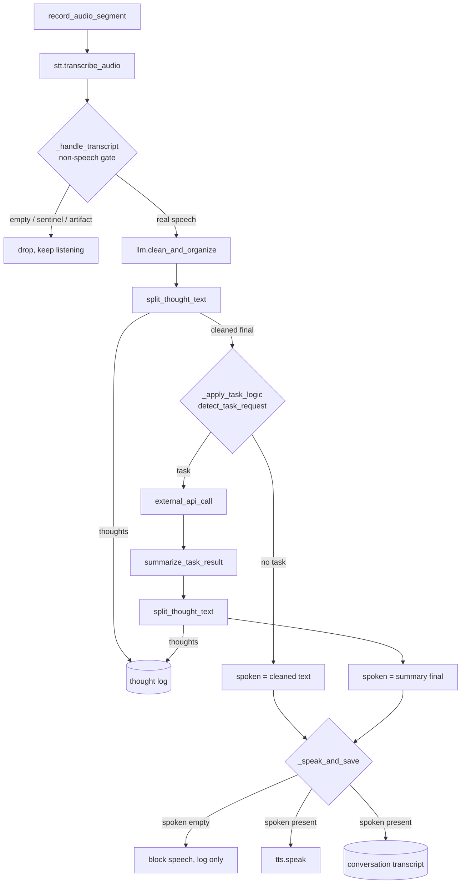
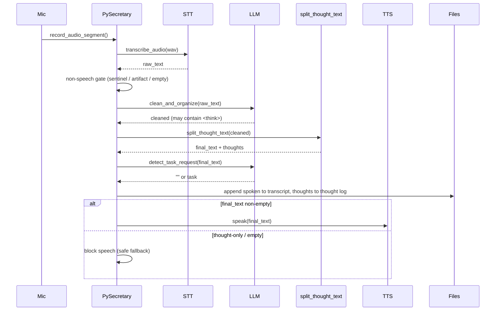

# Simple Voice Loop (`pysecretary.app`)

This document is the source of truth for `pysecretary.app`, the **simple synchronous
voice loop**. Update it whenever the loop's orchestration, dependency injection,
thought-safety handling, or persistence behavior changes.

`pysecretary.app` is one of two orchestrators in the project:

| Orchestrator | Module | Capture model | Entry point | When to use |
| --- | --- | --- | --- | --- |
| Simple voice loop | `pysecretary.app` | Fixed-length segments, fully serial | `python -m pysecretary` / `run` | Smoke testing the end-to-end path with minimal moving parts |
| Voice smoothing pipeline | `pysecretary.prototype` | Continuous VAD turns, queued workers | `python -m pysecretary prototype-ui` | Continuous, non-blocking capture and the UI dashboard |

The continuous pipeline is the strategic target (see
[`voice_prototype.md`](voice_prototype.md) and the App State Machine milestone in
[`../planning/roadmap.md`](../planning/roadmap.md)). The simple loop is retained as a
dependency-light reference path. Both must obey the same safety rules in
[`../DESIGN.md`](../DESIGN.md): thoughts never reach TTS, and STT non-speech artifacts
never reach the LLM.

## Purpose

`PySecretary` records one fixed-length microphone segment, transcribes it, asks the
LLM to clean it, optionally routes a follow-up task, and speaks a **thought-safe**
final result. It then loops. A console input thread accepts typed commands and a
stop word.

## Public Interface

```python
class PySecretary:
    def __init__(
        self,
        config: SecretaryConfig | None = None,
        stt: SpeechToTextClient | None = None,
        llm: LLMClient | None = None,
        tts: TextToSpeechClient | None = None,
    ) -> None: ...

    def start(self) -> None: ...   # blocking capture+console loop until stop
    def stop(self) -> None: ...    # set the stop flag
    def external_api_call(self, task: str) -> str: ...  # extension point
```

### Dependency injection

If `stt`, `llm`, and `tts` are all provided, the constructor performs **no network
discovery**. A single shared `KoboldCppClient` is created only when any client is
missing. This keeps the loop testable offline and lets callers wire fakes.

```python
secretary = PySecretary(config=config, stt=fake_stt, llm=fake_llm, tts=fake_tts)
```

## Data Flow



## Sequence (one spoken turn)



## Thought Safety

- Every model output that can reach the user is passed through
  [`split_thought_text`](transcript.md) before TTS. `<think>...</think>` blocks,
  including an unterminated trailing `<think>` (a truncated stream), are removed.
- Captured thoughts are appended to `config.thought_log_path` (`thoughts.log` by
  default, covered by `.gitignore` via `*.log`). They are **never** written to
  `config.transcript_path`.
- If, after stripping thoughts, the final text is empty, the loop **blocks speech**
  and prints a safe fallback instead of speaking reasoning.
- The conversation transcript records `RAW TRANSCRIPT`, `CLEANED TEXT`, and
  `SPOKEN OUTPUT` only.

## Non-Speech Filtering

`_handle_transcript` drops STT output that is empty, a non-speech sentinel
(`is_non_speech_transcript`, e.g. `BLANK_AUDIO`), or an audio-caption artifact
(`is_non_content_transcript`, e.g. `(upbeat music)`) before any LLM/TTS call.
Typed commands via `_handle_text_command` are trusted user input and bypass this
gate.

## Error Behavior

- `Ctrl+C` triggers `stop()`; `exit`/`quit`/`stop` typed in the console also stops.
- HTTP/device errors from STT/LLM/TTS currently surface as exceptions; recoverable
  per-call error handling is owned by the App State Machine milestone, not this
  simple loop.

## Configuration

- `transcript_path` (`PSEC_TRANSCRIPT_PATH`): conversation transcript file.
- `thought_log_path` (`PSEC_THOUGHT_LOG_PATH`): separate thought-trace log.
- `segment_seconds` (`PSEC_SEGMENT_SECONDS`): fixed capture length for this loop.

## Tests

- `tests/test_app.py` (Layer 2/3):
  - `<think>` content is stripped before TTS and stored only in the thought log,
  - thought-only output blocks speech,
  - non-speech sentinels and audio-caption artifacts are dropped before LLM/TTS,
  - manual commands bypass the non-speech gate,
  - the task path speaks a sanitized summary and logs task/summary thoughts,
  - construction with injected clients performs no network discovery.
- `tests/test_config.py` covers `thought_log_path` default and override.
