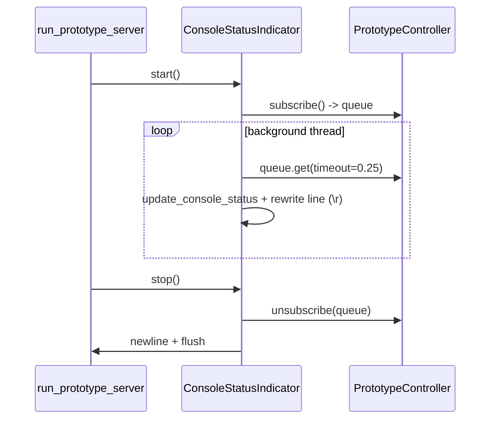

# CLI Status Indicator (`pysecretary.console`)

This document is the source of truth for `pysecretary.console`. Update it whenever the
status fields, formatting, event mapping, or indicator lifecycle change.

`pysecretary.console` renders a single in-place status line for the interactive
terminal while the prototype runs. It is a **control surface over events**, like the
web UI: it subscribes to the controller's event stream and never touches audio, STT,
LLM, or KoboldCPP directly. It satisfies the CLI status requirement in
[`voice_prototype.md`](voice_prototype.md) and [`ui.md`](ui.md).

## Data Contract: `ConsoleStatus`

| Field | Type | Source events |
| --- | --- | --- |
| `status` | `str` | `AssistantStateChanged`, `RecordingStarted/Stopped`, `AssistantError` |
| `stage` | `str` | pipeline events (see mapping) |
| `audio_level` | `float` | `AudioLevelChanged` |
| `audio_detected` | `bool` | `AudioLevelChanged`, cleared on `RecordingStopped` |
| `in_speech_turn` | `bool` | `AudioLevelChanged`, cleared on `RecordingStopped` |
| `audio_queue_depth` | `int` | `QueueDepthChanged.audio_turn_queue` |
| `raw_queue_depth` | `int` | `QueueDepthChanged.raw_transcript_queue` |

## Event → Stage Mapping

`update_console_status(status, event)` maps pipeline events to a coarse `stage`:

| Event | Stage |
| --- | --- |
| `RecordingStarted` | `capturing` |
| `SpeechTurnCompleted` | `queued-stt` |
| `SpeechTurnDiscarded` | `discard:<reason>` |
| `TranscriptionStarted` | `transcribing` |
| `TranscriptionDiscarded` | `discard-stt:<reason>` |
| `RawTranscriptReceived` | `raw-ready` |
| `TranscriptMergeStarted` | `merging` |
| `TranscriptMergeDeferred` | `merge-wait:<reason>` |
| `TranscriptMergeCompleted` | `merged` |
| `AssistantError` | `error:<stage>` |

## Rendered Line

`format_console_status` produces a fixed-shape line covering every field the
prototype contract requires (assistant status, audio detected vs quiet, level, VAD
turn state, audio/text queue depths, processing stage):

```text
status=listening audio=DETECTED level=0.037 vad=turn q=audio:2 text:1 stage=merging
```

## Indicator Lifecycle



- The indicator only activates on a TTY (`stream.isatty()`), or when `enabled` is set
  explicitly (used by tests). It rewrites one line in place with `\r` and pads to clear
  the previous line; it never prints a new line per chunk.
- A daemon thread drains the subscriber queue so rendering cannot block the pipeline.

## Tests

`tests/test_console.py` (Layer 1):

- audio-level and queue-depth events populate the single-line fields,
- `RecordingStopped` clears audio detection and sets `status=stopped`.
