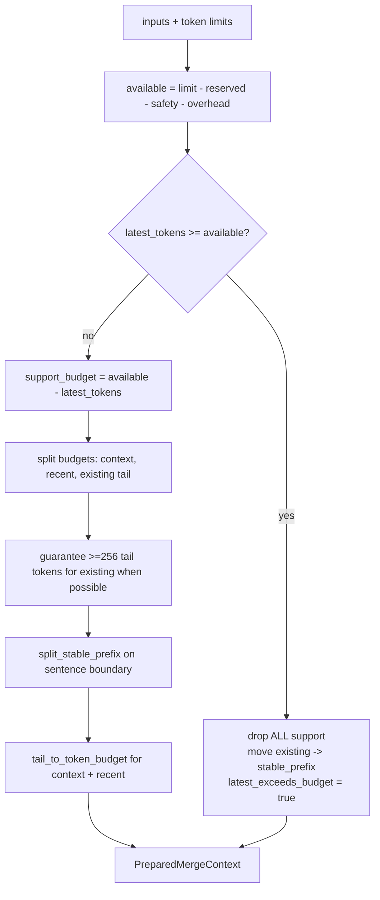

# Prompt Context Budgeting (`pysecretary.context_budget`)

This document is the source of truth for `pysecretary.context_budget`. Update it
whenever the budgeting algorithm, the `PreparedMergeContext` contract, or the
preservation invariants change.

`pysecretary.context_budget` ensures a transcript-merge prompt fits the local model's
context window **without ever discarding the latest raw transcript text** being
cleaned. It is pure, deterministic, and dependency-free; it is consumed by
`LLMTranscriptMerger` (see [`transcript.md`](transcript.md)). The context limit itself
is discovered by the KoboldCPP adapter (see [`koboldcpp.md`](koboldcpp.md)).

## Data Contract: `PreparedMergeContext` (frozen)

| Field | Type | Meaning |
| --- | --- | --- |
| `existing_smoothed_text` | `str` | Editable tail of prior cleaned transcript sent to the LLM |
| `stable_prefix` | `str` | Older cleaned transcript kept **outside** the prompt; recombined after |
| `recent_raw_context` | `str` | Compacted recent raw context |
| `current_context_summary` | `str` | Compacted context summary |
| `new_raw_text` | `str` | Latest raw sections, **always verbatim** |
| `context_limit_tokens` | `int` | Limit used for this calculation |
| `available_input_tokens` | `int` | Limit minus reserved/overhead/safety |
| `estimated_input_tokens` | `int` | Estimated prompt size after reduction |
| `support_was_reduced` | `bool` | Any supporting material was trimmed |
| `latest_exceeds_budget` | `bool` | Latest sections alone exceed the input budget |

## Algorithm

```
available      = limit - response_reserved - safety - prompt_overhead
latest_tokens  = estimate_tokens(new_raw_text)        # latest is sacrosanct
support_budget = max(0, available - latest_tokens)
```



`estimate_tokens` uses a conservative `~4 chars/token` approximation
(`ceil(len/4)`, min 1 for non-empty). A real tokenizer can replace it later behind the
same function signature.

Budget splitting (when latest fits): context summary and recent raw each get up to
`min(512, support_budget // 5)`; the rest goes to the existing-transcript tail, with a
floor of 256 tokens for the tail when the budget allows, so cleanup keeps enough recent
cleaned context to work against.

Trimming helpers cut on the nearest **forward** boundary (`\n\n`, `\n`, `. `, etc.) so
reductions land on sentence/clause edges, not mid-word. `tail_to_token_budget` prefixes
trimmed support with `[older support context omitted]`.

## Invariants (safety-critical)

- **The latest raw sections are never summarized, compacted, or dropped.** If they
  alone exceed the budget, all supporting material is removed and
  `latest_exceeds_budget` is set, but `new_raw_text` is passed through unchanged.
- Older cleaned transcript that does not fit becomes `stable_prefix` and is preserved
  **by the program**, outside the LLM prompt. After the LLM returns the cleaned tail,
  `combine_stable_prefix(prefix, tail)` restores it (joining on a newline after
  sentence-ending punctuation, else a space).
- The final `smoothed_text` is therefore always built from original/cleaned transcript
  text, never from a lossy summary of the latest content.

## Tests

`tests/test_context_budget.py` (Layer 1):

- token estimator ratio,
- latest raw text preserved while support is reduced (`stable_prefix` set,
  estimate under the limit),
- latest sections preserved even when they exceed the budget (support cleared,
  `latest_exceeds_budget`),
- `combine_stable_prefix` rejoins original prefix text.

End-to-end recombination through the merger is pinned in
`tests/test_transcript_merge.py::test_llm_merger_preserves_original_prefix_when_context_guard_reduces_history`.
