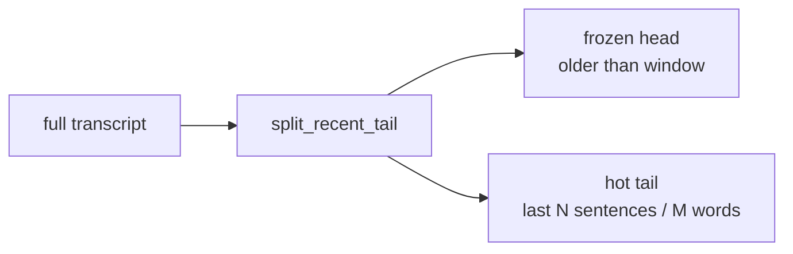

# Transcript Tail Splitting (`pysecretary.context_budget`)

This document is the source of truth for `pysecretary.context_budget`. Update it whenever the
tail-splitting or prefix-joining helpers change.

`pysecretary.context_budget` holds the small, pure text helpers used by the transcript merge
to keep only a recent **hot tail** re-editable while freezing everything older. It does no
LLM I/O and has no dependencies. It is consumed by `pysecretary.prototype`
(`PrototypeController._process_merge`); see
[`voice_prototype.md`](voice_prototype.md) Persistent Full Transcript and
[`transcript.md`](transcript.md).

> History: an earlier token-budget guard (`prepare_merge_context`, `estimate_tokens`,
> `tail_to_token_budget`, `split_stable_prefix`) lived here. It became obsolete once the merge
> began sending only a small editable tail (plus the compact context summary), so it was
> removed. The current module is just the two helpers below.

## `split_recent_tail(text, max_sentences, max_words) -> (head, tail)`

Splits the full transcript into a **frozen head** and a **re-editable hot tail**:

- The tail is the last `max_sentences` sentences, capped to at most `max_words` words —
  whichever yields the **shorter** tail (so the frozen head can only grow, never shrink).
- The tail may end mid-sentence; that is intentional — the merge lets the model decide
  whether new speech completes the trailing sentence or starts a new one.
- Sentence boundaries are detected with a simple `[.!?]` + closing-quote + whitespace regex;
  the word cap counts whitespace-separated tokens from the end.
- Empty/whitespace input returns `("", "")`.

Config drives the window: `merge_lookback_sentences` and `merge_lookback_words`
([`../DESIGN.md`](../DESIGN.md)).

## `combine_stable_prefix(prefix, tail) -> str`

Joins a frozen head and a (re)cleaned tail/region on a sentence-aware separator: a newline
when the prefix ends with sentence-ending punctuation (`. ! ? : ;`), otherwise a space (so a
sentence split across the boundary continues naturally). Empty sides are handled (returns the
non-empty one).

The controller uses these together: `split_recent_tail` to choose the editable tail before a
merge, and `combine_stable_prefix(head, region)` to splice the model's corrected region back
onto the frozen head on a `continue`.

## Tests

`tests/test_context_budget.py` (Layer 1):

- `split_recent_tail` keeps the last sentence editable, caps by words, lets the word cap
  override a long final sentence, and handles empty input;
- `combine_stable_prefix` joins on sentence punctuation, continues a mid-sentence head with a
  space, and handles empty sides.
