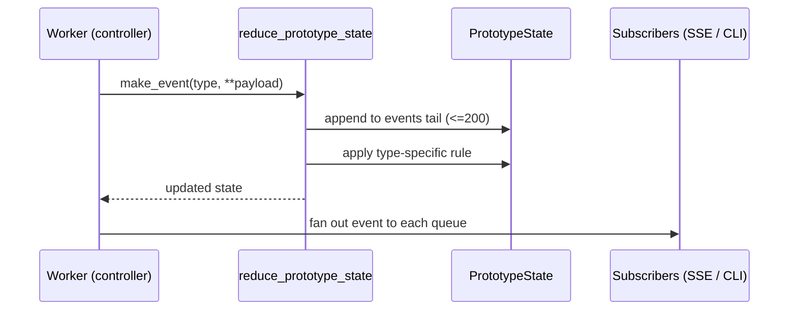

# Events, Commands, And UI-Facing State (`pysecretary.events`)

This document is the source of truth for `pysecretary.events`. Update it whenever the
event/command payload shapes, the reducer rules, or the `PrototypeState` snapshot
contract change.

`pysecretary.events` owns the **data contracts** that flow between backend workers and
any control surface (web dashboard or CLI). It owns no I/O. The producing side is the
controller in [`voice_prototype.md`](voice_prototype.md); the rendering side is
[`ui.md`](ui.md) and [`console.md`](console.md).

## Data Contracts

### `AssistantEvent` (immutable)

| Field | Type | Notes |
| --- | --- | --- |
| `type` | `str` | Event name (see Event Types) |
| `payload` | `dict[str, Any]` | Event-specific fields |
| `timestamp` | `float` | `time.time()` at creation |
| `event_id` | `str` | `uuid4().hex` |

`to_dict()` → `{"id", "type", "timestamp", "payload"}`. JSON-serializable. Use
`make_event(type, **payload)` to construct.

### `AssistantCommand` (immutable)

| Field | Type | Notes |
| --- | --- | --- |
| `type` | `str` | Command name (see Command Types) |
| `payload` | `dict[str, Any]` | Command-specific fields |

`to_dict()` → `{"type", "payload"}`.

### `PrototypeState` (mutable snapshot)

The reducer's accumulated UI-facing state. `to_dict()` returns a JSON-safe deep-ish
copy used by both the HTTP `/api/state` snapshot and the SSE initial frame. Key fields:

| Field | Type | Meaning |
| --- | --- | --- |
| `running` | `bool` | A capture session is active |
| `status` | `str` | One of the state vocabulary values below |
| `raw_transcripts` | `list[dict]` | Accepted STT sections (append + id) |
| `discarded_turns` | `list[dict]` | Turns dropped before STT |
| `discarded_transcriptions` | `list[dict]` | STT output dropped as non-speech |
| `smoothed_text` | `str` | The single full cleaned transcript; settled head is frozen, only the recent hot tail is re-editable |
| `context_summary` / `context_action` | `str` | Merge context carry-over; `context_action` drives paragraph breaks |
| `feedback` / `thoughts` | `list[dict]` | Merge notes vs. captured reasoning (kept apart) |
| `errors` | `list[dict]` | `{stage, message, timestamp}` |
| `events` | `list[dict]` | Rolling tail (last 200) for diagnostics |
| `last_audio_level` / `audio_detected` / `in_speech_turn` | mixed | Live mic feedback |
| `queue_depths` | `dict[str,int]` | `audio_turn_queue`, `raw_transcript_queue` |
| `worker_options` | `dict[str,float]` | Live VAD/gate sensitivity values shown/edited by the UI |

## State Vocabulary

`status` is the single shared vocabulary across backend, reducer, JS, and CLI:

| Status | Set by | `running` |
| --- | --- | --- |
| `listening` | `RecordingStarted`, `AssistantStateChanged(listening)` | `true` |
| `idle` | merge worker drained, not stopped | `false` |
| `stopped` | `RecordingStopped`, stop command | `false` |
| `error` | `AssistantError` | `false` |

> Note: `processing` and `speaking` from the broader app-state design
> ([`../DESIGN.md`](../DESIGN.md)) are reserved for the future App State Machine
> milestone and are **not** emitted by the prototype. Per-stage progress in the
> prototype is conveyed through the discrete pipeline events below, not through
> `status`. Keep this table and the DESIGN state machine in sync when that milestone
> lands.

## Reducer Rules

`reduce_prototype_state(state, event)` mutates and returns `state`. It always appends
the event to the rolling `events` tail (capped at 200), then applies type-specific
rules. Invariants enforced by the reducer and pinned by tests:

- `ThoughtCaptured` text lands in `thoughts`, never in `smoothed_text` or `feedback`.
- `MergeFeedbackReceived` lands in `feedback`, separate from `thoughts`.
- `SmoothedTranscriptUpdated` carries the full accumulated transcript in `text` and the
  reducer stores it in `smoothed_text`; it updates `context_summary` when a summary is
  present or when `context_action == "renew"` (so `paragraph`/`continue` keep the topic
  summary, `renew` replaces/clears it). `context_action` is one of `continue`, `paragraph`,
  or `renew`. The controller (not the reducer) does the hot-tail splice / accumulation (see
  [`voice_prototype.md`](voice_prototype.md) Persistent Full Transcript).
- `AssistantError` sets `status="error"` and `running=False`.
- `PrototypeTranscriptCleared` resets all transcript/feedback/thought/queue fields.

## Event Types

Emitted by the prototype controller (see [`voice_prototype.md`](voice_prototype.md)
for emission order):

`AssistantStateChanged`, `RecordingStarted`, `RecordingStopped`, `AudioLevelChanged`,
`QueueDepthChanged`, `SpeechTurnCompleted`, `SpeechTurnDiscarded`,
`TranscriptionStarted`, `TranscriptionDiscarded`, `RawTranscriptReceived`,
`TranscriptMergeStarted`, `TranscriptMergeDeferred`, `ThoughtCaptured`,
`MergeFeedbackReceived`, `SmoothedTranscriptUpdated`, `TranscriptMergeCompleted`,
`AssistantError`, `PrototypeTranscriptCleared`, `WorkerOptionsChanged`, `TranscriptSent`.

## Command Types

`StartAutomaticCapture`, `StopAutomaticCapture`, `ClearPrototypeTranscript`,
`UpdateWorkerOption`, `SendTranscript` (push finalized text to the output bridge —
see [`output_bridge.md`](output_bridge.md)).

Commands are accepted only at the controller boundary
(`PrototypeController.handle_command`). UI widgets must not call workers directly.

## Reducer Parity

The browser reducer in `pysecretary/web/static/app.js` must mirror these rules so the
UI can apply incremental events between snapshots. Known parity requirements:

- `AssistantError` must set both `status="error"` and `running=false` (matches the
  Python reducer).
- On reconnect, the UI re-syncs from the `/api/state` snapshot, so transient drift
  self-heals; persistent rules above must still match.

## Tests

`tests/test_events.py` (Layer 1/3):

- events/commands serialize to stable dicts,
- reducer keeps raw/smoothed/feedback/thoughts separate,
- context summary renew/clear semantics,
- `PrototypeTranscriptCleared` resets panels,
- queue depth updates.
