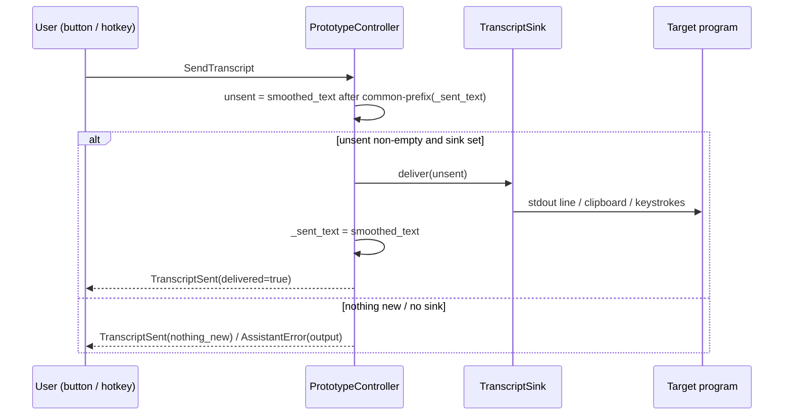

# Output Bridge (`pysecretary.output_bridge`)

This document is the source of truth for `pysecretary.output_bridge` and the push-to-send
flow in the controller. Update it whenever the sink contract, the send semantics, or the
hotkey behavior change.

## Purpose

Turn finalized spoken text into **input for another program** — pipe it to a CLI's stdin,
copy it to the clipboard, or type it into the focused window. Delivery is **push-to-send**:
nothing leaves pySecretary until you trigger it (a UI button or a global hotkey), so the
transcript's re-flowing hot tail never spams the target.

## Data Contract: `TranscriptSink` (Protocol)

```python
class TranscriptSink(Protocol):
    def deliver(self, text: str) -> None: ...
```

Implementations (all in `output_bridge.py`; pynput/pyperclip are **lazy-imported** so the core
never depends on them):

| Sink | `PSEC_OUTPUT_SINK` | Mechanism | Optional deps |
| --- | --- | --- | --- |
| `StdoutSink` | `stdout` | one line per utterance on stdout (`pysecretary … \| yourprog`) | none |
| `ClipboardSink` | `clipboard` | `pyperclip.copy`; optional Ctrl+V auto-paste (`output_clipboard_autopaste`) | `pyperclip` (+ `pynput` for auto-paste) |
| `KeystrokeSink` | `keystroke` | types into the focused window via `pynput` | `pynput` |

`make_sink(name, *, auto_paste=False)` builds a sink by name, returns `None` for `""`/`none`,
and raises `ValueError` for an unknown name.

Optional deps live in `requirements-output.txt` (kept out of core `requirements.txt` because
`pynput` pulls in `evdev`, which needs C build tools). Install with
`uv pip install -r requirements-output.txt`.

## Push-to-send flow (controller)

- The controller holds a sink (`config.output_sink`, or an injected one) and `_sent_text`,
  the transcript already delivered.
- On the `SendTranscript` command it computes the **unsent suffix** = the current
  `smoothed_text` after its longest common prefix with `_sent_text`, delivers that via the
  sink, advances `_sent_text`, and emits `TranscriptSent {delivered, text}`.
- Nothing new → `TranscriptSent {delivered: false, reason: "nothing_new"}`. No sink → an
  `AssistantError` (stage `output`). Sink exceptions are caught and surfaced as
  `AssistantError`, never crashing the pipeline.
- `ClearPrototypeTranscript` resets `_sent_text`.



## Triggers

- **UI button** ("Send") posts `SendTranscript` — works when the dashboard is focused
  (handy for stdout/clipboard).
- **Global hotkey** (`OutputHotkeyListener`, `config.output_hotkey`, e.g. `<ctrl>+<alt>+s`):
  fires `SendTranscript` even when another window is focused — required for keystroke
  injection (you're typing into the target app, not the dashboard). Uses `pynput` lazily;
  best-effort (does nothing if pynput is missing). Started/stopped by `run_prototype_server`.

## Safety notes

- Keystroke injection types into **whatever currently has focus** — push-to-send (not
  continuous) keeps you in control of when and where text lands.
- Output is opt-in: with no `PSEC_OUTPUT_SINK`, `SendTranscript` is a no-op error and nothing
  is ever sent anywhere.

## Configuration

- `PSEC_OUTPUT_SINK`: `""` (off) | `stdout` | `clipboard` | `keystroke`.
- `PSEC_OUTPUT_CLIPBOARD_AUTOPASTE`: `1` to send Ctrl+V after clipboard copy.
- `PSEC_OUTPUT_HOTKEY`: pynput hotkey string for global push-to-send (e.g. `<ctrl>+<alt>+s`).

## Tests

- `tests/test_output_bridge.py` (Layer 1/2): `StdoutSink` line output, `make_sink` name
  resolution + unknown-name error, clipboard auto-paste flag.
- `tests/test_voice_prototype.py`: `SendTranscript` delivers only the unsent remainder, errors
  with no sink, and `ClearPrototypeTranscript` resets the sent marker. (pynput/pyperclip are
  not exercised — sinks are injected.)
