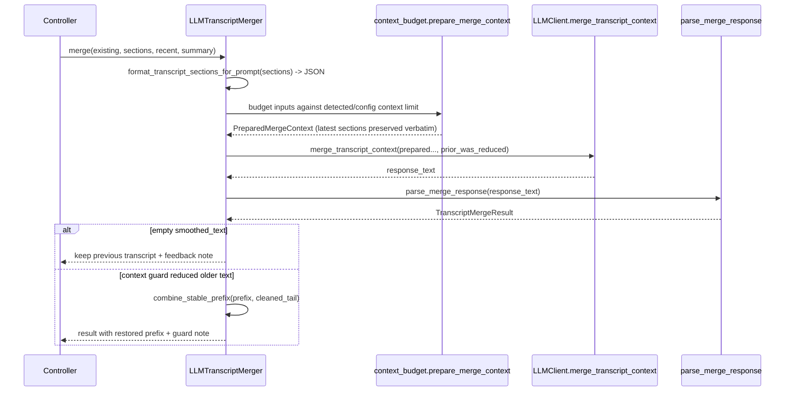

# Transcript Merge And Thought Separation (`pysecretary.transcript`)

This document is the source of truth for `pysecretary.transcript`. Update it whenever
the thought-splitting rules, the merge-result contract, the merger protocol, or the
JSON parsing rules change.

`pysecretary.transcript` owns two responsibilities:

1. **Thought separation** — split `<think>...</think>` reasoning from user-facing text.
2. **Transcript merging** — turn raw STT sections plus prior state into secretary-grade
   cleaned text (grammar/sentence repair, not verbatim transcription), delegating the
   actual LLM call to [`llm.py`](../DESIGN.md) and context budgeting to
   [`context_budget.md`](context_budget.md). Cross-context persistence (sealing previous
   contexts) is owned by the controller, not the merger — see
   [`voice_prototype.md`](voice_prototype.md) Persistent Full Transcript.

## Data Contracts

### `ThoughtSplit` (frozen)

| Field | Type | Notes |
| --- | --- | --- |
| `final_text` | `str` | User-safe text with thought blocks removed |
| `thoughts` | `list[str]` | Extracted reasoning fragments |

### `TranscriptSection` (frozen)

The unit of raw transcript handed to the merger. Carries provenance/timing so the LLM
can order, stitch, and self-correct. Fields: `turn_id`, `sequence`, `text`,
`captured_at`, `transcribed_at`, `duration_seconds`, `speech_seconds`, `peak_level`.
`to_prompt_dict()` serializes a rounded, model-friendly view.

### `TranscriptMergeResult` (frozen)

| Field | Type | Notes |
| --- | --- | --- |
| `smoothed_text` | `str` | Full updated cleaned transcript (not a diff) |
| `feedback` | `list[str]` | Cleanup notes (UI feedback panel) |
| `thoughts` | `list[str]` | Captured reasoning (debug panel only) |
| `context_summary` | `str` | Compact carry-over for the next merge |
| `context_action` | `str` | `continue` or `renew` |

### `TranscriptMerger` (Protocol)

```python
def merge(
    existing_smoothed_text: str,
    new_raw_sections: list[TranscriptSection],
    recent_raw_context: str = "",
    current_context_summary: str = "",
) -> TranscriptMergeResult: ...
```

Implementations: `LLMTranscriptMerger` (production), plus `DemoTranscriptMerger` and
test fakes. The controller depends on the protocol, not a concrete class.

## Thought Splitting Rules

`split_thought_text(text) -> ThoughtSplit`:

- All complete `<think>...</think>` blocks (case-insensitive, dot-all) are removed and
  their inner text collected.
- A trailing **unterminated** `<think>` (truncated/streamed output) is also removed and
  its partial content collected — nothing after an open `<think>` may leak.
- `final_text` is the remaining text, stripped.

This is the single chokepoint used both by the simple app loop ([`app.md`](app.md))
before TTS and by merge-response parsing.

## Merge Response Parsing

`parse_merge_response(response_text)`:

1. Run `split_thought_text` first so reasoning never contaminates parsed output.
2. Try to extract a JSON object (whole string, then the outermost `{...}` slice).
3. On JSON: read `smoothed_text` (or `updated_text`/`text`), `feedback`/`notes`,
   any `thoughts`, `context_summary`, normalized `context_action`.
4. On no JSON: fall back to treating `final_text` as `smoothed_text` (plain-text
   tolerance, as required by the prototype contract).

`context_action` normalizes `renew|new|new_conversation|reset` → `renew`, else
`continue`.

## `LLMTranscriptMerger` Flow



The context limit is resolved from the discovered `KoboldCppProfile.context_limit_tokens`
when available, else `config.llm_context_window_tokens`.

## Invariants

- The merger returns cleaned text for the editable region: on `continue`, the editable
  tail combined with the new sections; on `renew`, only the cleaned new sections (the
  controller seals the prior context).
- If the LLM returns no usable `smoothed_text`, the previous transcript is preserved
  and a feedback note is added (no data loss).
- When the context guard moved older cleaned text outside the prompt, that stable
  prefix is recombined with the model's cleaned tail; the latest raw sections are
  never summarized away (see [`context_budget.md`](context_budget.md)).

## Tests

`tests/test_transcript_merge.py` (Layer 1/2):

- thought split for complete, multiple, and unterminated tags,
- JSON and plain-text merge responses,
- feedback/thought separation,
- empty-output fallback preserves the prior transcript,
- context-guard prefix recombination.
